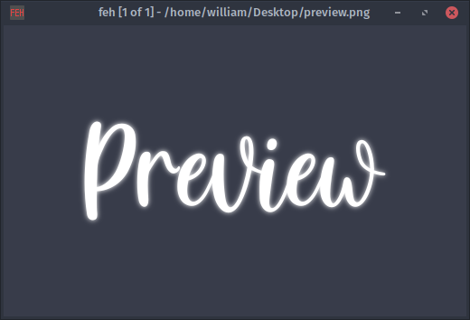

# XFWM Arc Dark Modifications

A collection of custom modifications of the Arc Dark XFWM theme for XFCE. Each folder in the themes directory contains a different variation of the theme.

---

## Themes

| Theme | Description | Preview |
|-------|------------|--------|
| arc-dark-mod | Arc Dark XFWM theme with transparent stick and shade buttons. |  |
| arc-dark-mod-1 | XFWM theme based on Arc Dark with 3px window borders. |  |
| arc-dark-mod-2 | Arc Dark XFWM theme with 3px borders and highlighted active window. |  |
| arc-dark-mod-3 | XFCE original theme with 3px borders on all sides except the top. |  |

---

## Installation

Follow these steps to install a theme for your user:

1. Make sure you have a `.themes` directory in your home folder. If not, create it:
mkdir -p ~/.themes

2. Copy the desired theme folder from this repository into `~/.themes`:
cp -r themes/<theme-name> ~/.themes/

3. Open XFCE Settings Manager → Window Manager → Style and select your new theme.

---

Thank you for checking out these XFWM theme modifications!

